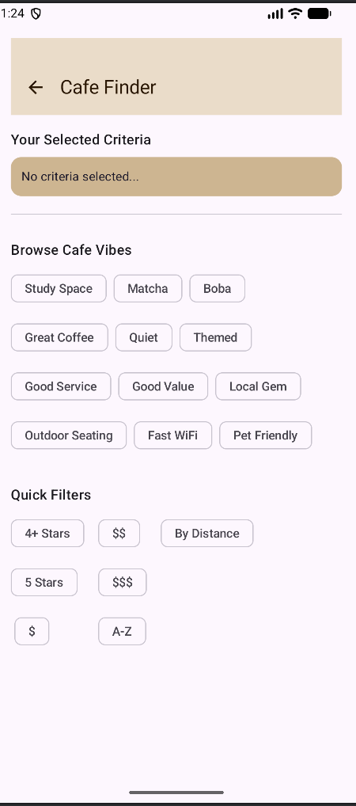

# Cafe Finder Tag Browser (Flow Layout Mastery)

### 📝 Project Overview
This application demonstrates dynamic, wrapping layouts in Jetpack Compose using the modern `FlowRow` and `FlowColumn` components. The "Cafe Finder" theme allows users to browse and select various "vibes" (tags) that wrap intelligently based on screen width, providing a fluid and responsive user experience.

### 🚀 Key Technical Features
* **Dynamic Tag Wrapping**: Uses `FlowRow` to display a large list of cafe tags. Unlike a standard Row, the tags automatically move to the next line when they hit the screen edge.
* **Vertical Filter Columns**: Implements `FlowColumn` with `maxItemsInEachColumn = 3` to organize quick filter options into a multi-column grid that scales vertically.
* **Reactive State Management**: Utilizes a `MutableState<Set<String>>` to track user selections. Tapping a tag updates the "Selected Criteria" area in real-time.

### 🎨 Material 3 Requirements Met
The following M3 components were implemented to satisfy the project rubric:
1.  **FilterChip**: Used in the browser section to demonstrate the "selected" state with a leading check icon.
2.  **AssistChip**: Used in the "Selected Criteria" area to represent active filters.
3.  **SuggestionChip**: Used within the `FlowColumn` for quick-action filter options.
4.  **TopAppBar**: Features a themed background and an `AutoMirrored` back arrow icon.
5.  **IconButton**: Encapsulates the navigation action in the header.
6.  **Surface**: Provides a distinct background container and rounded corners for the "Selected Criteria" area.
7.  **HorizontalDivider**: Visually separates the interactive sections of the screen.

### 🛠️ Modifiers Demonstrated
* **`Arrangement.spacedBy(8.dp)`**: Ensures consistent horizontal and vertical gutter spacing between all chips within the Flow layouts.
* **`fillMaxWidth()` & `padding()`**: Implemented across containers to ensure the UI stretches to fit the device screen while maintaining readable margins.
* **Visual State Selection**: The `FilterChip` dynamically updates its colors, border, and elevation based on the `isSelected` boolean state.
* **`weight(1f)`**: Applied to the vertical filters section to ensure it occupies the appropriate remaining screen space.

---

### 📱 Execution Environment
* **Device**: Pixel 8 Pro Emulator
* **SDK Version**: Android 36 (targetSdk)
* **Min SDK**: 26
* **Compose BOM**: 2026.01.00

### 📸 Screenshot

